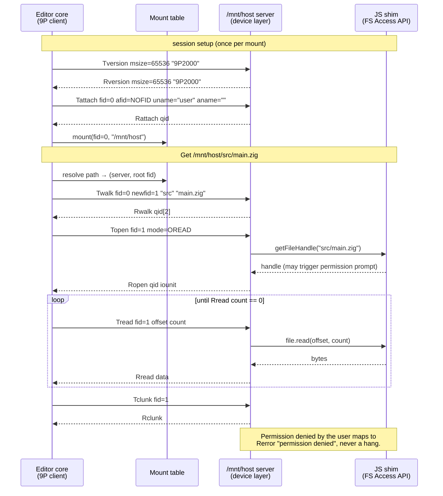

# 9P session — editor core reading a host file via /mnt/host (spec 01)

Mermaid review mirror of [`9p-session.puml`](../9p-session.puml) — the PlantUML source remains authoritative.

<!-- Divergence: PlantUML's `== section ==` dividers have no Mermaid equivalent; they are
     rendered here as `Note over` banners spanning all participants. -->
<!-- Divergence: PlantUML `->` (solid) / `-->` (dashed reply) map to Mermaid `->>` / `-->>`. -->

