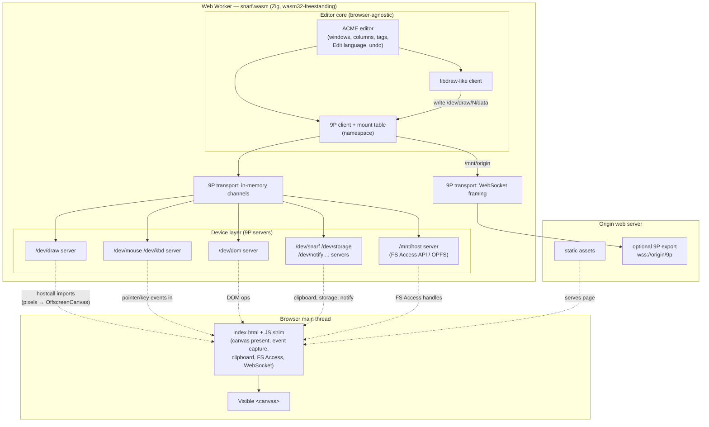

# Snarf — layered architecture (spec 00)

Mermaid review mirror of [`architecture.puml`](../architecture.puml) — the PlantUML source remains authoritative.

<!-- Divergence: PlantUML `package` / `cloud` groupings both become Mermaid `subgraph`s;
     Mermaid has no distinct cloud shape for a container. -->
<!-- Divergence: PlantUML `..>` (dependency, dashed) maps to Mermaid `-.->`. -->
<!-- Divergence: `[Visible <canvas>]` is escaped as `&lt;canvas&gt;` so the Mermaid/HTML
     label renderer does not swallow it as a tag. -->

