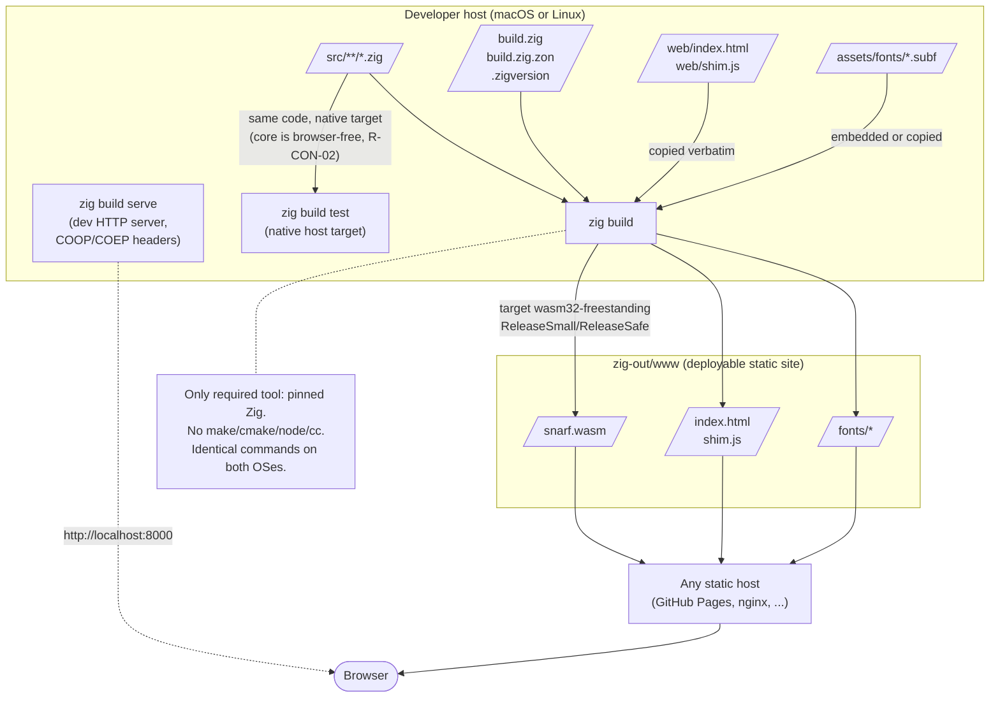

# Build & dev flow — Zig only, macOS or Linux (spec 06, ADR-0001)

Mermaid review mirror of [`build-flow.puml`](../build-flow.puml) — the PlantUML source remains authoritative.

<!-- Divergence: PlantUML `file` / `rectangle` / `folder` / `cloud` / `actor` shapes have no
     one-to-one Mermaid equivalents. Files use the `[/.../]` parallelogram, build steps use
     rectangles, output/host containers use `subgraph`s, and the `actor Browser` is a
     stadium node. -->
<!-- Divergence: the `note bottom of ZB` becomes a standalone node linked to ZB with a
     dotted edge, since Mermaid flowcharts have no floating note element. -->

