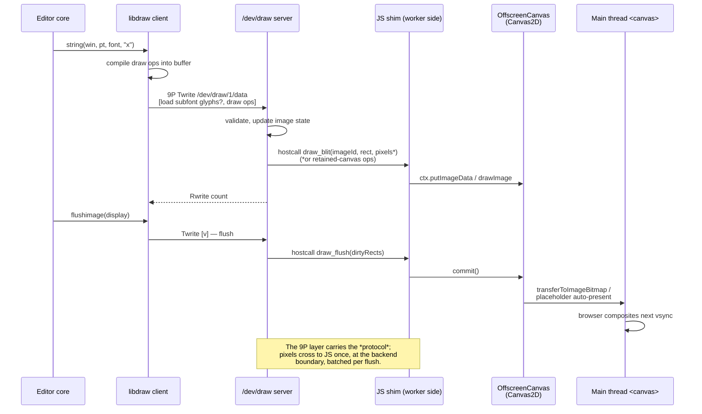

# Draw pipeline — one frame of typing (spec 03)

Mermaid review mirror of [`draw-pipeline.puml`](../draw-pipeline.puml) — the PlantUML source remains authoritative.

<!-- Divergence: PlantUML `->` (solid) / `-->` (dashed reply) map to Mermaid `->>` / `-->>`.
     Self-messages (`L -> L`) keep the solid form. -->
<!-- Divergence: the PlantUML trailing comment on `L -> D : Twrite [v]  ' flush` is folded
     into the message text here, since Mermaid has no inline comment on a message line. -->
<!-- Divergence: Mermaid's sequence parser treats `;` and `<`/`>` as syntax, so the literal
     `;` in the note and the angle brackets of `<canvas>` are written as the numeric escapes
     `#59;`, `#lt;` and `#gt;`. They render as the intended characters. -->

