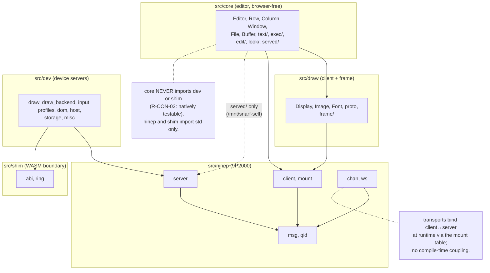

# Module dependency rules — allowed imports only (spec 07 §6)

Mermaid review mirror of [`module-deps.puml`](../module-deps.puml) — the PlantUML source remains authoritative.

<!-- Divergence: PlantUML `package` groupings become Mermaid `subgraph`s. -->
<!-- Divergence: PlantUML `..>` (dependency, dashed) maps to Mermaid `-.->`. -->
<!-- Divergence: the two floating notes (`note bottom of core`, `note right of XPORT`) become
     standalone nodes tied to their subject with dotted, unlabelled edges, since Mermaid
     flowcharts have no floating note element. -->

