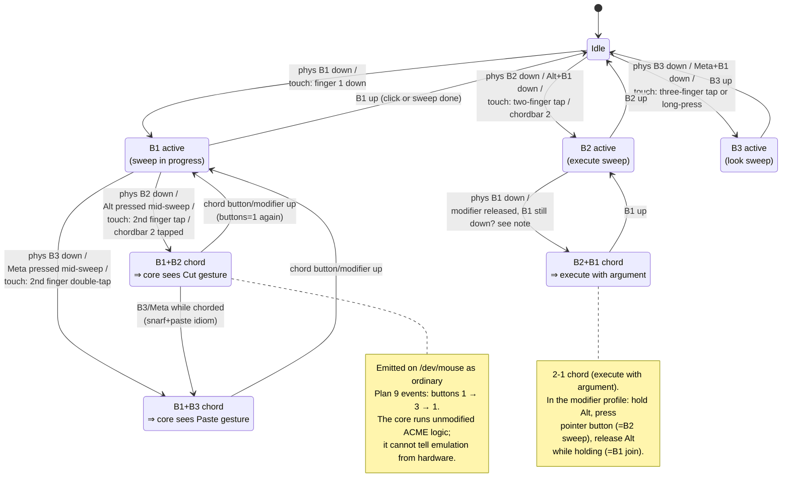

# Input server — logical button/chord synthesis state machine (spec 04, ADR-0004)

Mermaid review mirror of [`mouse-chords.puml`](../mouse-chords.puml) — the PlantUML source remains authoritative.

<!-- Divergence: PlantUML's empty `state Idle { }` bodies carry no content and are declared
     here as plain states. -->
<!-- Divergence: PlantUML's `note bottom of Arg` becomes `note right of Arg`; Mermaid state
     notes support only `left of` / `right of`. -->

