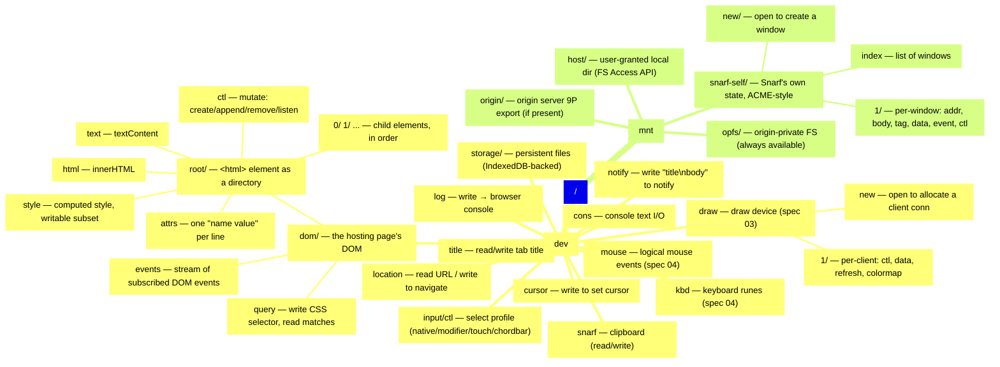

# Snarf namespace — assembled mount table (spec 02)

Mermaid review mirror of [`namespaces.puml`](../namespaces.puml) — the PlantUML source remains authoritative.

<!-- Divergence: every node carries an explicit id and a quoted `[...]` label, because bare
     Mermaid mindmap text treats `(`, `)`, `[` and `]` as shape delimiters. -->
<!-- Divergence: `<html>` is escaped as `&lt;html&gt;`, and the literal double quotes in the
     /dev/notify entry are written as `&quot;`, so the label parses. -->

